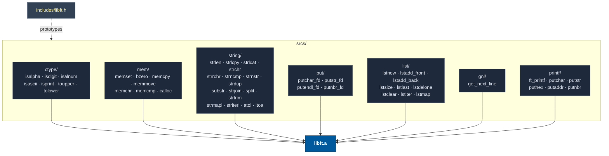
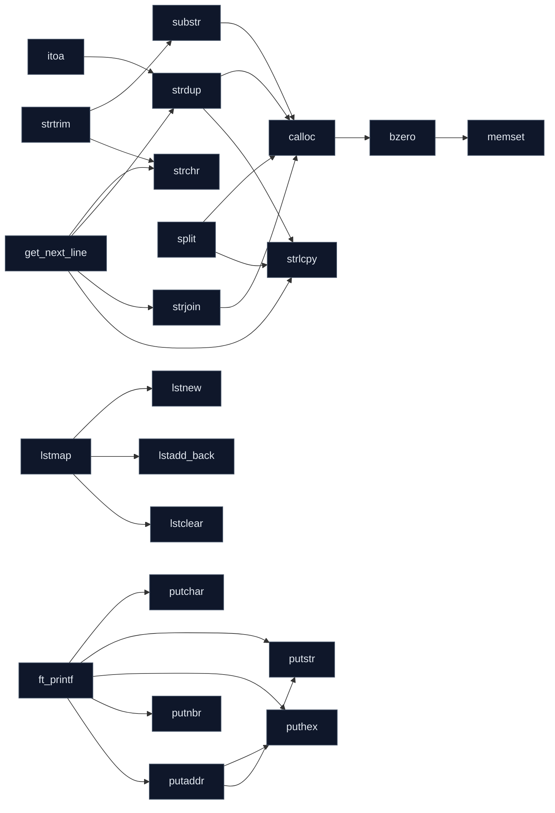
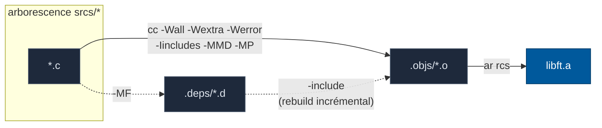
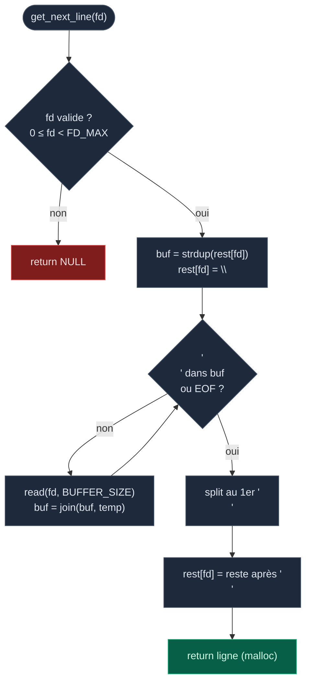
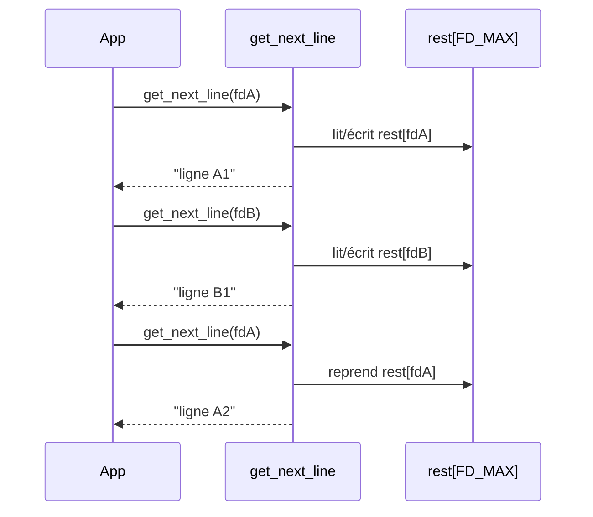
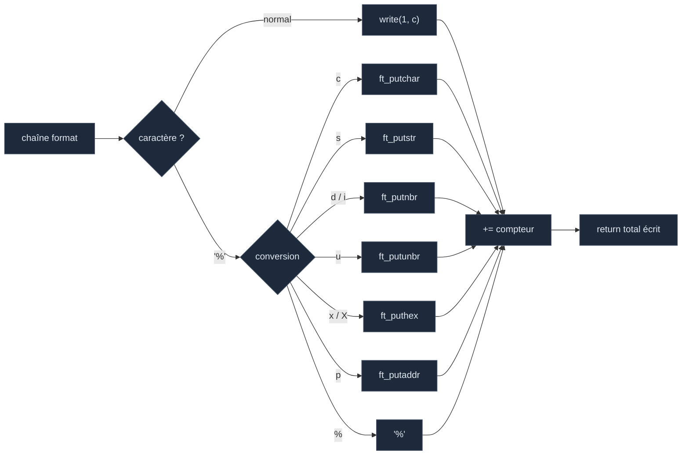

<div align="center">

# 📚 libft

**Ma bibliothèque C standard maison — 42 School**

Réimplémentation propre des fonctions de la libc, étendue avec les
**listes chaînées**, **`get_next_line`** et **`ft_printf`**, le tout
réuni dans une seule archive `libft.a`.


</div>

---

## 📖 Sommaire

- [Aperçu](#-aperçu)
- [Architecture](#-architecture)
- [Compilation](#-compilation)
- [Pipeline de build](#-pipeline-de-build)
- [Utilisation](#-utilisation)
- [Modules & fonctions](#-modules--fonctions)
- [Zoom : get_next_line multi-fd](#-zoom--get_next_line-multi-fd)
- [Zoom : ft_printf](#-zoom--ft_printf)
- [Norme](#-norme)

---

## 🔭 Aperçu

`libft` regroupe **50 fonctions** réparties en 7 modules. Tout est compilé
par un **unique `make`** (plus de règle `bonus` séparée) et produit l'archive
statique `libft.a` à lier dans tes projets.

| Caractéristique | Détail |
|---|---|
| 🧩 Modules | `ctype` · `mem` · `string` · `put` · `list` · `gnl` · `printf` |
| 📦 Sortie | `libft.a` |
| 🧾 Header | `includes/libft.h` (unique, tout est dedans) |
| 🎯 Flags | `-Wall -Wextra -Werror` |
| 🧠 GNL | multi-fd, stash **statique sans `malloc`** |
| ✅ Norme | norminette OK sur `srcs/` et `includes/` |

---

## 🏗 Architecture



**Dépendances internes** (qui appelle qui) :



---

## ⚙️ Compilation

```bash
make          # construit libft.a (libc + listes + gnl + printf)
make clean    # supprime les objets (.objs) et dépendances (.deps)
make fclean   # clean + supprime libft.a
make re       # fclean puis rebuild
make norm     # lance la norminette sur srcs/ et includes/
```

Le Makefile affiche une **barre de progression animée** pendant la compilation :

```text
libft [###############-----------]  58%  ft_atoi
 libft.a ready (50 objects)
```

---

## 🔧 Pipeline de build



- Les **objets** vont dans `.objs/`, les **dépendances** dans `.deps/`.
- `-MMD -MP` génère les `.d` : modifier un header ne recompile que le nécessaire.
- `VPATH` permet de garder les sources rangées par module tout en gardant des objets « à plat ».

---

## 🚀 Utilisation

Dans ton projet, lie l'archive et inclus le header :

```c
#include "libft.h"

int main(void)
{
    ft_printf("Hello %s, %d modules!\n", "world", 7);

    char **tokens = ft_split("a,b,c", ',');
    ft_printf("premier token: %s\n", tokens[0]);

    t_list *node = ft_lstnew(tokens[0]);
    ft_printf("taille liste: %d\n", ft_lstsize(node));
    return (0);
}
```

```bash
cc main.c -Iincludes -L. -lft -o app
# ou directement :
cc main.c libft.a -Iincludes -o app
```

---

## 🧩 Modules & fonctions

### `ctype` — classification de caractères
`ft_isalpha` · `ft_isdigit` · `ft_isalnum` · `ft_isascii` · `ft_isprint` · `ft_toupper` · `ft_tolower`

### `mem` — manipulation mémoire
`ft_memset` · `ft_bzero` · `ft_memcpy` · `ft_memmove` · `ft_memchr` · `ft_memcmp` · `ft_calloc`

### `string` — chaînes de caractères
`ft_strlen` · `ft_strlcpy` · `ft_strlcat` · `ft_strchr` · `ft_strrchr` · `ft_strncmp` · `ft_strnstr` · `ft_strdup` · `ft_substr` · `ft_strjoin` · `ft_split` · `ft_strtrim` · `ft_strmapi` · `ft_striteri` · `ft_atoi` · `ft_itoa`

### `put` — écriture sur descripteur
`ft_putchar_fd` · `ft_putstr_fd` · `ft_putendl_fd` · `ft_putnbr_fd`

### `list` — listes chaînées (`t_list`)
`ft_lstnew` · `ft_lstadd_front` · `ft_lstadd_back` · `ft_lstsize` · `ft_lstlast` · `ft_lstdelone` · `ft_lstclear` · `ft_lstiter` · `ft_lstmap`

```c
typedef struct s_list
{
    void            *content;
    struct s_list   *next;
}   t_list;
```

### `gnl` — lecture ligne par ligne
`get_next_line` — lit un fd ligne par ligne, supporte plusieurs descripteurs en parallèle.

### `printf` — affichage formaté
`ft_printf` — conversions supportées : `%c %s %p %d %i %u %x %X %%`

---

## 🔍 Zoom : `get_next_line` multi-fd

Le reste de lecture de chaque fd est conservé dans un **tableau statique fixe**
(`char rest[FD_MAX][BUFFER_SIZE + 1]`) : aucun `malloc` pour le stash, et
plusieurs fd peuvent être lus en alternance sans se mélanger.



**Lecture entrelacée de 3 fichiers :**



---

## 🖨 Zoom : `ft_printf`



---

## ✅ Norme

Tout le code respecte la **norminette** (42). Vérification :

```bash
make norm
# ou
norminette srcs includes
```

---

<div align="center">
<sub>Fait avec ☕ et beaucoup de <code>-Wall -Wextra -Werror</code> — by <b>sgil--de</b></sub>
</div>
