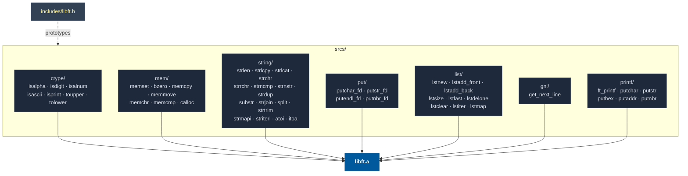
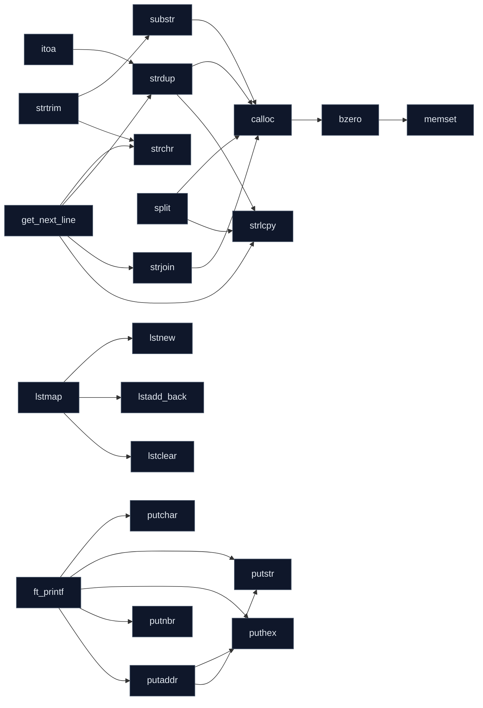
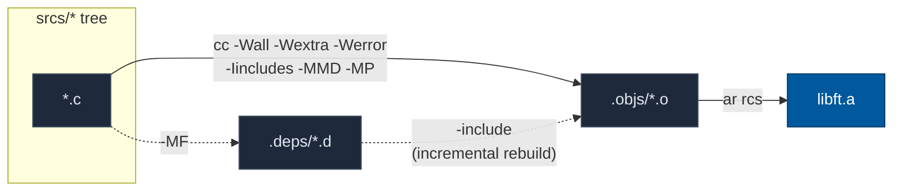
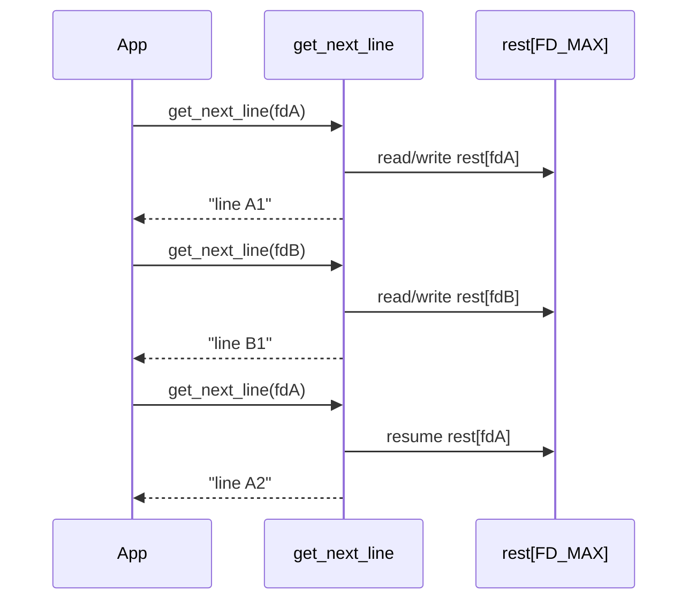
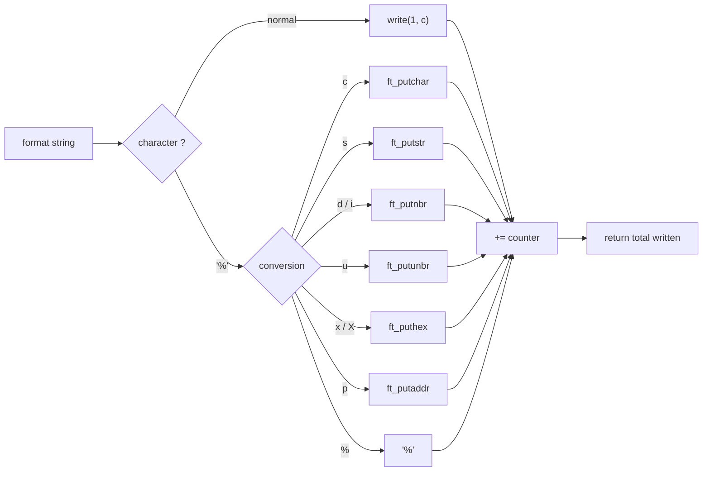

<div align="center">

# 📚 libft

**My custom C standard library — 42 School**

A clean reimplementation of libc functions, extended with
**linked lists**, **`get_next_line`**, and **`ft_printf`**, all
combined into a single `libft.a` archive.


</div>

---

## 📖 Table of Contents

- [Overview](#-overview)
- [Architecture](#-architecture)
- [Compilation](#-compilation)
- [Build Pipeline](#-build-pipeline)
- [Usage](#-usage)
- [Modules & Functions](#-modules--functions)
- [Focus: Multi-fd get_next_line](#-focus-multi-fd-get_next_line)
- [Focus: ft_printf](#-focus-ft_printf)
- [Norm](#-norm)

---

## 🔭 Overview

`libft` contains **50 functions** divided into 7 modules. Everything is compiled
with a **single `make`** command (no separate `bonus` rule anymore) and produces
the static archive `libft.a` that can be linked into your projects.

| Feature | Details |
|---|---|
| 🧩 Modules | `ctype` · `mem` · `string` · `put` · `list` · `gnl` · `printf` |
| 📦 Output | `libft.a` |
| 🧾 Header | `includes/libft.h` (single header, everything included) |
| 🎯 Flags | `-Wall -Wextra -Werror` |
| 🧠 GNL | multi-fd, static stash **without `malloc`** |
| ✅ Standard | norminette OK on `srcs/` and `includes/` |

---

## 🏗 Architecture



**Internal dependencies** (who calls what):



---

## ⚙️ Compilation

```bash
make          # builds libft.a (libc + lists + gnl + printf)
make clean    # removes object files (.objs) and dependencies (.deps)
make fclean   # clean + remove libft.a
make re       # fclean then rebuild
make norm     # runs norminette on srcs/ and includes/
```

The Makefile displays an **animated progress bar** during compilation:

```text
libft [###############-----------]  58%  ft_atoi
 libft.a ready (50 objects)
```

---

## 🔧 Build Pipeline



- **Objects** go into `.objs/`, **dependencies** into `.deps/`.
- `-MMD -MP` generates `.d` files: modifying a header only recompiles what's necessary.
- `VPATH` keeps sources organized by module while keeping object files "flat".

---

## 🚀 Usage

In your project, link the archive and include the header:

```c
#include "libft.h"

int main(void)
{
    ft_printf("Hello %s, %d modules!\n", "world", 7);

    char **tokens = ft_split("a,b,c", ',');
    ft_printf("first token: %s\n", tokens[0]);

    t_list *node = ft_lstnew(tokens[0]);
    ft_printf("list size: %d\n", ft_lstsize(node));
    return (0);
}
```

```bash
cc main.c -Iincludes -L. -lft -o app
# or directly:
cc main.c libft.a -Iincludes -o app
```

---

## 🧩 Modules & Functions

### `ctype` — character classification
`ft_isalpha` · `ft_isdigit` · `ft_isalnum` · `ft_isascii` · `ft_isprint` · `ft_toupper` · `ft_tolower`

### `mem` — memory manipulation
`ft_memset` · `ft_bzero` · `ft_memcpy` · `ft_memmove` · `ft_memchr` · `ft_memcmp` · `ft_calloc`

### `string` — string functions
`ft_strlen` · `ft_strlcpy` · `ft_strlcat` · `ft_strchr` · `ft_strrchr` · `ft_strncmp` · `ft_strnstr` · `ft_strdup` · `ft_substr` · `ft_strjoin` · `ft_split` · `ft_strtrim` · `ft_strmapi` · `ft_striteri` · `ft_atoi` · `ft_itoa`

### `put` — file descriptor output
`ft_putchar_fd` · `ft_putstr_fd` · `ft_putendl_fd` · `ft_putnbr_fd`

### `list` — linked lists (`t_list`)
`ft_lstnew` · `ft_lstadd_front` · `ft_lstadd_back` · `ft_lstsize` · `ft_lstlast` · `ft_lstdelone` · `ft_lstclear` · `ft_lstiter` · `ft_lstmap`

```c
typedef struct s_list
{
    void            *content;
    struct s_list   *next;
}   t_list;
```

### `gnl` — line-by-line reading
`get_next_line` — reads an fd line by line, supports multiple descriptors simultaneously.

### `printf` — formatted output
`ft_printf` — supported conversions: `%c %s %p %d %i %u %x %X %%`

---

## 🔍 Focus: Multi-fd `get_next_line`

The remaining data for each fd is stored in a **fixed static array**
(`char rest[FD_MAX][BUFFER_SIZE + 1]`): no `malloc` for the stash, and
multiple file descriptors can be read alternately without mixing data.

**Interleaved reading from 3 files:**



---

## 🖨 Focus: `ft_printf`



---

## ✅ Norm

All code follows the **42 norminette** standard. Verification:

```bash
make norm
# or
norminette srcs includes
```

---

<div align="center">
<sub>Made with ☕ and lots of <code>-Wall -Wextra -Werror</code> — by <b>sgil--de</b></sub>
</div>
